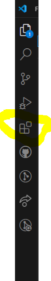
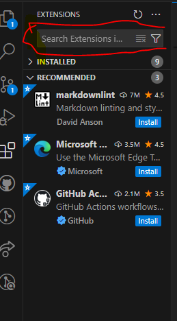
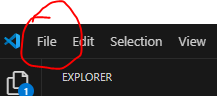
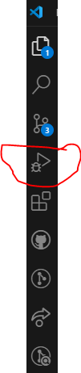
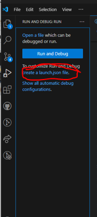

# SE-Assignment-5
Installation and Navigation of Visual Studio Code (VS Code)
 Instructions:
Answer the following questions based on your understanding of the installation and navigation of Visual Studio Code (VS Code). Provide detailed explanations and examples where appropriate.

 Questions:

1. Installation of VS Code:
   - Describe the steps to download and install Visual Studio Code on Windows 11 operating system. Include any prerequisites that might be needed.
   1. Installation of VS Code:

### Steps to Download and Install Visual Studio Code on Windows 11:

## Download VS Code:

- Go to the official Visual Studio Code website.
- Click the "Download" button for Windows.

2. First-time Setup:
   - After installing VS Code, what initial configurations and settings should be adjusted for an optimal coding environment? Mention any important settings or extensions.

   ## Run the Installer:

Once the download is complete, run the installer (VSCodeUserSetup-x64-1.x.x.exe).
Follow the prompts in the setup wizard. Accept the license agreement, choose the installation location, and select additional tasks like creating a desktop icon.
Complete Installation:
Click "Install" to begin the installation.
Once the installation is finished, click "Finish" to launch Visual Studio Code.
Prerequisites:
Ensure you have administrative privileges to install software on your computer.
There are no specific prerequisites, but having Git installed is beneficial for source control functionality. You can download Git from git-scm.com.

## First-time Setup:
# Initial Configurations and Settings:
Theme and Appearance:

- Go to File > Preferences > Color Theme and select a theme that suits your preference.
Settings Sync:

- Enable Settings Sync by clicking on the gear icon in the bottom left corner and selecting Turn on Settings Sync.
# Extensions:

- Open the Extensions view by clicking the Extensions icon in the Activity Bar or pressing Ctrl+Shift+X.
Install essential extensions like:
Prettier - Code Formatter
ESLint
Python (if coding in Python)
Live Server (for web development)

# Settings Configuration:

Go to File > Preferences > Settings or press Ctrl+,
Common settings to adjust:
"editor.fontSize": 14 (or your preferred font size)
"editor.tabSize": 2 (for 2-space indentation)
"files.autoSave": "afterDelay" (to enable auto-saving)

3. User Interface Overview:
   - Explain the main components of the VS Code user interface. Identify and describe the purpose of the Activity Bar, Side Bar, Editor Group, and Status Bar.

   # Main Components of the VS Code User Interface:

(a) Activity Bar:
Located on the far left, it provides access to different views like Explorer, Search, Source Control, Run and Debug, and Extensions.

(b) Side Bar:
Displays different panels depending on the selected Activity Bar icon (e.g., file explorer, search results).

(c) Editor Group:
The central area where files are opened and edited. You can open multiple files in tabs or split the editor to view files side by side.

(d) Status Bar:
Located at the bottom, it shows information about the current file, such as encoding, line/column number, and git branch. It also provides quick access to certain functions like language mode.

4. Command Palette:
   - What is the Command Palette in VS Code, and how can it be accessed? Provide examples of common tasks that can be performed using the Command Palette.

   ## What is the Command Palette?

- The Command Palette provides access to many commands in VS Code.
- Access it by pressing Ctrl+Shift+P or F1.
# Examples of Common Tasks:

- Opening a file: > Open File
- Changing settings: > Preferences: Open Settings
- Installing extensions: > Extensions: Install Extensions
- Running a task: > Tasks: Run Task

5. Extensions in VS Code:
   - Discuss the role of extensions in VS Code. How can users find, install, and manage extensions? Provide examples of essential extensions for web development.

  ## Role of Extensions:

- Extensions enhance functionality and customize the development environment for specific needs.

# Finding Extensions:

- Open the Extensions view by clicking the Extensions icon in the Activity Bar or by pressing Ctrl+Shift+X.

# Installing Extensions:

Search for an extension  and then click the "Install" button.

# Managing Extensions:

-View installed extensions, enable/disable them, and configure their settings from the Extensions view.

# Examples of Essential Extensions for Web Development:

Live Server
Prettier - Code Formatter
ESLint
HTML CSS Support
JavaScript (ES6) code snippets

6. Integrated Terminal:
   - Describe how to open and use the integrated terminal in VS Code. What are the advantages of using the integrated terminal compared to an external terminal?

# Opening the Terminal:

- Go to View > Terminal or press Ctrl+` (backtick).

# Using the Terminal:

- You can run command-line operations directly within VS Code, such as navigating directories, running scripts, and using Git.

# Advantages:

- Context switching is minimized since you can write and test code in the same window.
- Integration with the editor allows for efficient workflow and automation.

7. File and Folder Management:
   - Explain how to create, open, and manage files and folders in VS Code. How can users navigate between different files and directories efficiently?

## Creating Files/Folders:
- Right-click in the Explorer view and select New File or New Folder.
- You can also click on file  then on 'New File'
- Use Ctrl+N for a new text file.

## Opening Files/Folders:

- Use File > Open Folder to open an entire project.
- Drag and drop files/folders into the Explorer view.

## Navigating Between Files:

- Use Ctrl+P to quickly open a file by name.
- Use Ctrl+Tab to cycle through open files.

8. Settings and Preferences:
   - Where can users find and customize settings in VS Code? Provide examples of how to change the theme, font size, and keybindings.

   ## Customizing Settings in VS Code:
# Accessing Settings:

- Go to File > Preferences > Settings or press Ctrl+,.

# Changing Settings:

Theme: Search for Color Theme and select your preferred theme.
Font Size: Search for Font Size and adjust the value.

# Keybindings:
- Go to File > Preferences > Keyboard Shortcuts to customize keybindings.

9. Debugging in VS Code:
   - Outline the steps to set up and start debugging a simple program in VS Code. What are some key debugging features available in VS Code?

  ## Setting Up and Starting Debugging:

# Open the Debug View:

- Click the Debug icon in the Activity Bar or press Ctrl+Shift+D.

# Configure Debugging:

- Click on create a launch.json file and select the appropriate environment (e.g., Node.js).

# Set Breakpoints:

- Click in the gutter next to the line numbers to set breakpoints.

## Start Debugging:

- Press F5 to start debugging.

## Key Debugging Features:

- Breakpoints
- Step over, step into, and step out
- Variable inspection
- Call stack navigation

10. Using Source Control:
    - How can users integrate Git with VS Code for version control? Describe the process of initializing a repository, making commits, and pushing changes to GitHub.

## Integrating Git with VS Code:

# Initialize a Repository:

- Open the Source Control view by clicking the Source Control icon in the Activity Bar or pressing Ctrl+Shift+G.
- Click Initialize Repository.

# Making Commits:

- Stage changes by clicking the + icon next to files.
- Enter a commit message and click the checkmark icon to commit.

# Pushing Changes to GitHub:

- Ensure you have a remote repository on GitHub.
- Use the terminal to set the remote: git remote add origin <repository-url>
Push changes: git push -u origin main (or the appropriate branch name)

